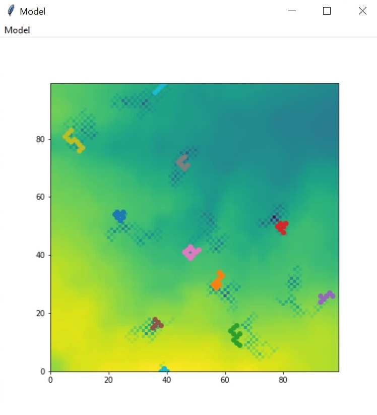

# Agent-Based Modelling
 
## What is agent-based modelling?
 
I have learnt a considerable amount on agent-based modelling curtesy of my university lecturer, Dr Andy Evans. Dr Andy Evans discusses agent-based modelling in-depth in a very informative webpage, which can be found [here]( http://www.geog.leeds.ac.uk/courses/other/crime/abm/general-modelling/index.html).
 
 
Below is a screenshot of the agent-based model I created in my practical.
 

 
 
To see my raw code for the work I have done for this assignment, please either [click here](https://github.com/jamesckent/jamesckent.github.io#readme), or, alternatively, you can click the top right of this page where it says "View On GitHub". Please then find the README file titled "Code for agent-based modelling university practical".